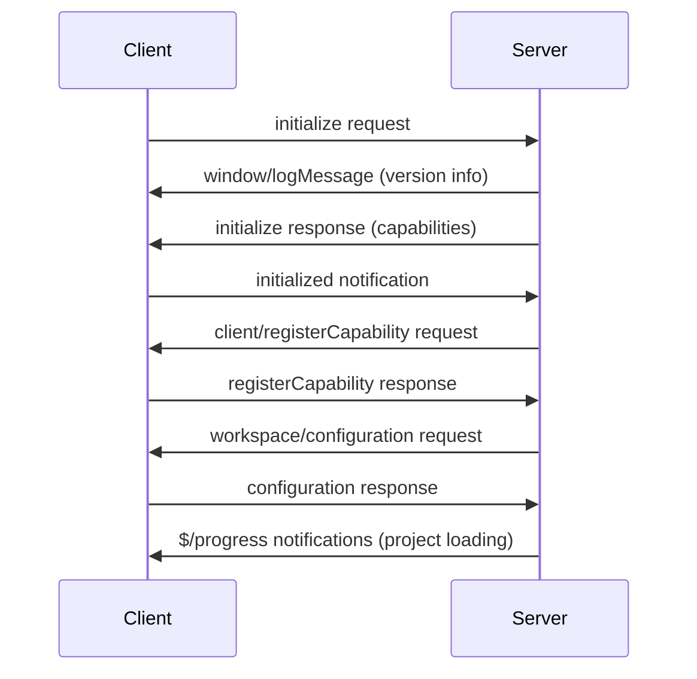
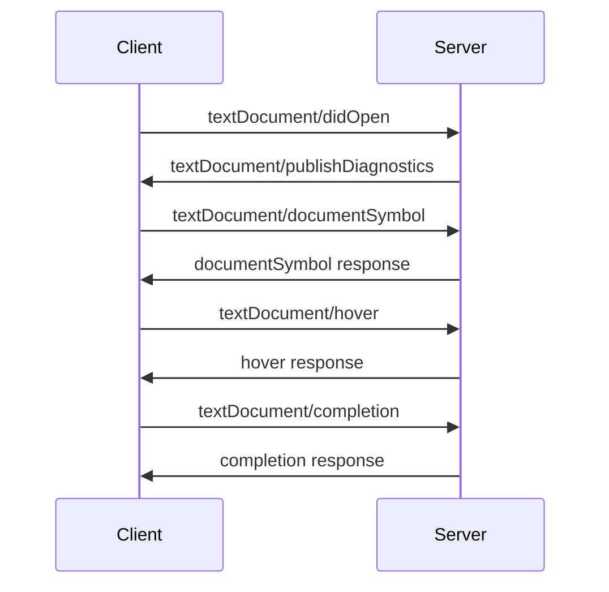
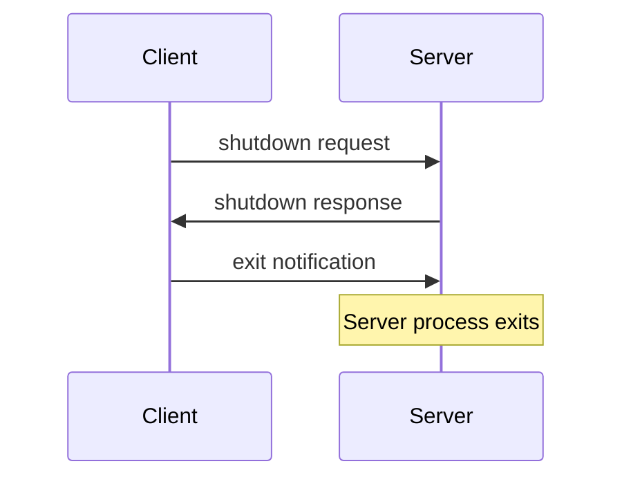

# Language Server Protocol (LSP) Communication Analysis

## Overview

This document provides a comprehensive analysis of LSP communication between a client and csharp-ls server, based on actual captured communication logs. It demonstrates the complete lifecycle of an LSP session from initialization to shutdown.

## Table of Contents

1. [Message Structure](#message-structure)
2. [Protocol Flow](#protocol-flow)
3. [Message Types](#message-types)
4. [Detailed Analysis](#detailed-analysis)
5. [Real Examples](#real-examples)

## Message Structure

All LSP messages follow the JSON-RPC 2.0 specification with HTTP-style headers:

```
Content-Length: <size>\r\n\r\n
<JSON-RPC message>
```

### JSON-RPC Message Types

#### Request Messages
```json
{
  "jsonrpc": "2.0",
  "id": <number>,
  "method": "<method_name>",
  "params": <params_object>
}
```

#### Response Messages
```json
{
  "jsonrpc": "2.0",
  "id": <number>,
  "result": <result_object>
}
```

#### Error Response
```json
{
  "jsonrpc": "2.0",
  "id": <number>,
  "error": {
    "code": <error_code>,
    "message": "<error_message>"
  }
}
```

#### Notification Messages
```json
{
  "jsonrpc": "2.0",
  "method": "<method_name>",
  "params": <params_object>
}
```

## Protocol Flow

### Phase 1: Initialization (Handshake)



### Phase 2: Document Operations



### Phase 3: Shutdown



## Message Types

### 1. Client-to-Server Requests

| Method | Purpose | Response |
|--------|---------|----------|
| `initialize` | Initialize LSP session | Server capabilities |
| `textDocument/documentSymbol` | Get document outline | Array of symbols |
| `textDocument/hover` | Get hover information | Hover content |
| `textDocument/definition` | Go to definition | Location array |
| `textDocument/references` | Find all references | Location array |
| `textDocument/completion` | Get code completions | Completion items |
| `textDocument/formatting` | Format document | Text edits |
| `textDocument/signatureHelp` | Get method signatures | Signature info |
| `shutdown` | Graceful shutdown | null |

### 2. Server-to-Client Requests

| Method | Purpose | Expected Response |
|--------|---------|-------------------|
| `client/registerCapability` | Register dynamic capabilities | Acknowledgment |
| `workspace/configuration` | Request workspace config | Configuration objects |
| `window/workDoneProgress/create` | Create progress indicator | Acknowledgment |

### 3. Client Notifications

| Method | Purpose | Parameters |
|--------|---------|------------|
| `initialized` | Initialization complete | {} |
| `textDocument/didOpen` | Document opened | Document content |
| `exit` | Exit server | null |

### 4. Server Notifications

| Method | Purpose | Parameters |
|--------|---------|------------|
| `window/logMessage` | Server logging | type, message |
| `$/progress` | Progress updates | token, value |
| `textDocument/publishDiagnostics` | Send diagnostics | uri, diagnostics |

## Detailed Analysis

### Initialization Sequence

#### 1. Initialize Request (Client → Server)

The client sends its capabilities and workspace information:

```json
{
  "jsonrpc": "2.0",
  "id": 1,
  "method": "initialize",
  "params": {
    "processId": 90316,
    "rootPath": "/Users/hiko/Desktop/csharp-ls-client",
    "rootUri": "file:///Users/hiko/Desktop/csharp-ls-client",
    "capabilities": {
      "textDocument": {
        "completion": { "dynamicRegistration": true },
        "hover": { "dynamicRegistration": true },
        "documentSymbol": { "dynamicRegistration": true },
        "definition": { "dynamicRegistration": true },
        "references": { "dynamicRegistration": true }
      }
    }
  }
}
```

**Key Parameters:**
- `processId`: Client process ID for monitoring
- `rootUri`: Workspace root URI
- `capabilities`: Client's supported features

#### 2. Initialize Response (Server → Client)

The server responds with its capabilities:

```json
{
  "jsonrpc": "2.0",
  "id": 1,
  "result": {
    "capabilities": {
      "textDocumentSync": {
        "openClose": true,
        "change": 2,
        "save": { "includeText": true }
      },
      "completionProvider": {
        "triggerCharacters": [".", "'"]
      },
      "hoverProvider": true,
      "definitionProvider": true,
      "referencesProvider": true,
      "documentSymbolProvider": true,
      "documentFormattingProvider": true,
      // ... more capabilities
    },
    "serverInfo": {
      "name": "csharp-ls",
      "version": "0.18.0.0"
    }
  }
}
```

**Key Capabilities:**
- `textDocumentSync`: How the server wants to receive document changes
- `completionProvider`: Code completion support with trigger characters
- `hoverProvider`: Hover information support
- Various other language features

#### 3. Initialized Notification (Client → Server)

```json
{
  "jsonrpc": "2.0",
  "method": "initialized",
  "params": {}
}
```

This signals that the client has processed the server capabilities.

#### 4. Dynamic Capability Registration (Server → Client)

```json
{
  "jsonrpc": "2.0",
  "id": 2,
  "method": "client/registerCapability",
  "params": {
    "registrations": [
      {
        "id": "8fd8d7b6-58c4-453b-80f4-6ff2811e42c6",
        "method": "textDocument/completion",
        "registerOptions": {
          "documentSelector": [{"scheme": "file", "pattern": "**/*.cs"}],
          "triggerCharacters": [".", "'"],
          "resolveProvider": true
        }
      }
      // ... more registrations
    ]
  }
}
```

The server can dynamically register additional capabilities with specific document selectors.

### Document Operations

#### Document Opening

```json
{
  "jsonrpc": "2.0",
  "method": "textDocument/didOpen",
  "params": {
    "textDocument": {
      "uri": "file:///Users/hiko/Desktop/csharp-ls-client/Program.cs",
      "languageId": "csharp",
      "version": 1,
      "text": "using System;\n// ... full document content"
    }
  }
}
```

#### Diagnostics Publishing

The server automatically sends diagnostics:

```json
{
  "jsonrpc": "2.0",
  "method": "textDocument/publishDiagnostics",
  "params": {
    "uri": "file:///Users/hiko/Desktop/csharp-ls-client/Program.cs",
    "diagnostics": [
      {
        "range": {
          "start": {"line": 0, "character": 6},
          "end": {"line": 0, "character": 12}
        },
        "severity": 2,
        "code": "CS8933",
        "source": "lsp",
        "message": "The using directive for 'System' appeared previously as global using"
      }
    ]
  }
}
```

**Diagnostic Severity Levels:**
- 1: Error
- 2: Warning  
- 3: Information
- 4: Hint

#### Document Symbols

Request:
```json
{
  "jsonrpc": "2.0",
  "id": 2,
  "method": "textDocument/documentSymbol",
  "params": {
    "textDocument": {
      "uri": "file:///Users/hiko/Desktop/csharp-ls-client/Program.cs"
    }
  }
}
```

Response:
```json
{
  "jsonrpc": "2.0",
  "id": 2,
  "result": [
    {
      "name": "Calculator",
      "kind": 5,
      "range": {
        "start": {"line": 6, "character": 0},
        "end": {"line": 29, "character": 0}
      },
      "selectionRange": {
        "start": {"line": 6, "character": 17},
        "end": {"line": 6, "character": 27}
      }
    }
  ]
}
```

**Symbol Kinds:**
- 1: File
- 3: Namespace
- 5: Class
- 6: Method
- 8: Field
- 9: Constructor

#### Code Completion

Request:
```json
{
  "jsonrpc": "2.0",
  "id": 6,
  "method": "textDocument/completion",
  "params": {
    "textDocument": {
      "uri": "file:///Users/hiko/Desktop/csharp-ls-client/Program.cs"
    },
    "position": {"line": 31, "character": 20}
  }
}
```

Response (truncated):
```json
{
  "jsonrpc": "2.0",
  "id": 6,
  "result": {
    "isIncomplete": true,
    "items": [
      {
        "label": "Console",
        "kind": 7,
        "sortText": "Console",
        "filterText": "Console",
        "insertTextFormat": 1,
        "data": 0
      }
    ]
  }
}
```

**Completion Item Kinds:**
- 3: Interface
- 7: Class
- 13: Enum
- 14: Keyword

### Progress Reporting

The server can report long-running operation progress:

```json
{
  "jsonrpc": "2.0",
  "method": "$/progress",
  "params": {
    "token": "5f01cee6-b084-46f3-b596-8bcc5d0898cf",
    "value": {
      "kind": "begin",
      "title": "Loading 1 project(s)...",
      "percentage": 0
    }
  }
}
```

Progress kinds:
- `begin`: Start of operation
- `report`: Progress update
- `end`: Operation complete

### Shutdown Sequence

#### 1. Shutdown Request
```json
{
  "jsonrpc": "2.0",
  "id": 9,
  "method": "shutdown",
  "params": null
}
```

#### 2. Shutdown Response
```json
{
  "jsonrpc": "2.0",
  "id": 9,
  "result": null
}
```

#### 3. Exit Notification
```json
{
  "jsonrpc": "2.0",
  "method": "exit",
  "params": null
}
```

## Key Observations

1. **Bidirectional Communication**: Both client and server can initiate requests
2. **Asynchronous Operations**: Diagnostics and progress are pushed asynchronously
3. **Dynamic Capabilities**: Servers can register capabilities after initialization
4. **Document Synchronization**: Client must notify server of document changes
5. **Graceful Shutdown**: Two-phase shutdown ensures clean termination
6. **Error Handling**: Detailed error codes and messages for debugging
7. **Performance**: Streaming and incomplete results for large datasets

## Testing and Implementation Notes

When implementing an LSP client:

1. **Handle all server requests**: Respond to capability registration and configuration requests
2. **Implement progress UI**: Show progress for long-running operations
3. **Process diagnostics**: Display errors/warnings to users
4. **Manage document synchronization**: Keep server in sync with document changes
5. **Implement graceful shutdown**: Always shutdown → exit sequence

This analysis demonstrates that LSP is a sophisticated protocol enabling rich language server integration while maintaining clean separation between client and server responsibilities.